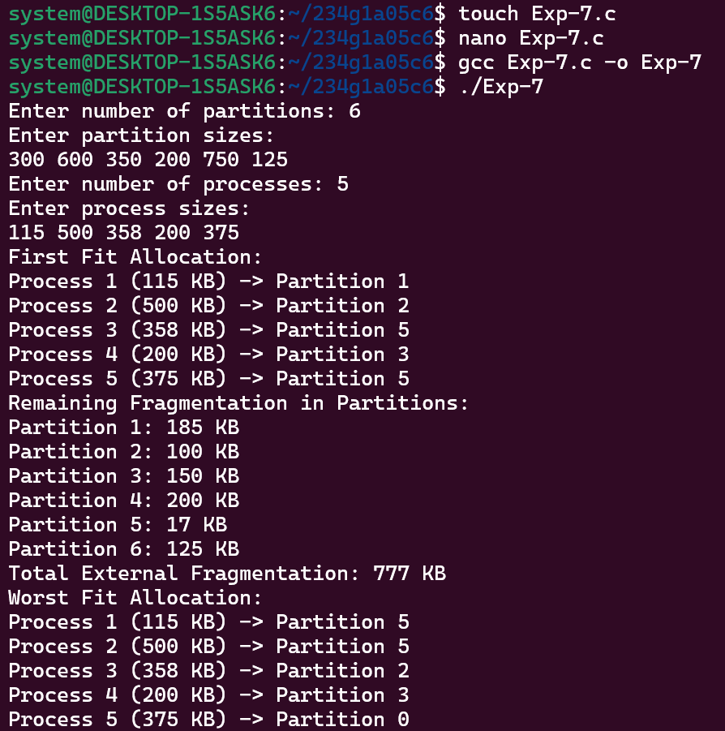

# Program statement: To implement memory allocation methods like first fit, best fit and worst first
# Source code:
```c
#include <stdio.h>

#define MAX 10  // Maximum number of partitions and processes

// Function to calculate and display fragmentation
void calculateFragmentation(int partitions[], int m) {
    int totalFragmentation = 0;
    printf("Remaining Fragmentation in Partitions:\n");
    for (int i = 0; i < m; i++) {
        printf("Partition %d: %d KB\n", i + 1, partitions[i]);
        totalFragmentation += partitions[i];
    }
    printf("Total External Fragmentation: %d KB\n", totalFragmentation);
}

// Function to implement First Fit memory allocation
void firstFit(int partitions[], int m, int processes[], int n) {
    int allocation[n];
    for (int i = 0; i < n; i++)
        allocation[i] = -1;
    
    for (int i = 0; i < n; i++) {
        for (int j = 0; j < m; j++) {
            if (partitions[j] >= processes[i]) {
                allocation[i] = j;
                partitions[j] -= processes[i];
                break;
            }
        }
    }
    
    printf("First Fit Allocation:\n");
    for (int i = 0; i < n; i++)
        printf("Process %d (%d KB) -> Partition %d\n", i + 1, processes[i], allocation[i] + 1);
    calculateFragmentation(partitions, m);
}

// Function to implement Worst Fit memory allocation
void worstFit(int partitions[], int m, int processes[], int n) {
    int allocation[n];
    for (int i = 0; i < n; i++)
        allocation[i] = -1;
    
    for (int i = 0; i < n; i++) {
        int worstIdx = -1;
        for (int j = 0; j < m; j++) {
            if (partitions[j] >= processes[i]) {
                if (worstIdx == -1 || partitions[j] > partitions[worstIdx])
                    worstIdx = j;
            }
        }
        if (worstIdx != -1) {
            allocation[i] = worstIdx;
            partitions[worstIdx] -= processes[i];
        }
    }
    
    printf("Worst Fit Allocation:\n");
    for (int i = 0; i < n; i++)
        printf("Process %d (%d KB) -> Partition %d\n", i + 1, processes[i], allocation[i] + 1);
    calculateFragmentation(partitions, m);
}

// Function to implement Best Fit memory allocation
void bestFit(int partitions[], int m, int processes[], int n) {
    int allocation[n];
    for (int i = 0; i < n; i++)
        allocation[i] = -1;
    
    for (int i = 0; i < n; i++) {
        int bestIdx = -1;
        for (int j = 0; j < m; j++) {
            if (partitions[j] >= processes[i]) {
                if (bestIdx == -1 || partitions[j] < partitions[bestIdx])
                    bestIdx = j;
            }
        }
        if (bestIdx != -1) {
            allocation[i] = bestIdx;
            partitions[bestIdx] -= processes[i];
        }
    }
    
    printf("Best Fit Allocation:\n");
    for (int i = 0; i < n; i++)
        printf("Process %d (%d KB) -> Partition %d\n", i + 1, processes[i], allocation[i] + 1);
    calculateFragmentation(partitions, m);
}

int main() {
    int partitions[MAX], processes[MAX], m, n;
    
    printf("Enter number of partitions: ");
    scanf("%d", &m);
    printf("Enter partition sizes:\n");
    for (int i = 0; i < m; i++)
        scanf("%d", &partitions[i]);
    
    printf("Enter number of processes: ");
    scanf("%d", &n);
    printf("Enter process sizes:\n");
    for (int i = 0; i < n; i++)
        scanf("%d", &processes[i]);
    
    int partitionsCopy[MAX];
    for (int i = 0; i < m; i++) partitionsCopy[i] = partitions[i];
    firstFit(partitionsCopy, m, processes, n);
    
    for (int i = 0; i < m; i++) partitionsCopy[i] = partitions[i];
    worstFit(partitionsCopy, m, processes, n);
    
    for (int i = 0; i < m; i++) partitionsCopy[i] = partitions[i];
    bestFit(partitionsCopy, m, processes, n);
    
    return 0;
}
```
# Output Screen Shots



